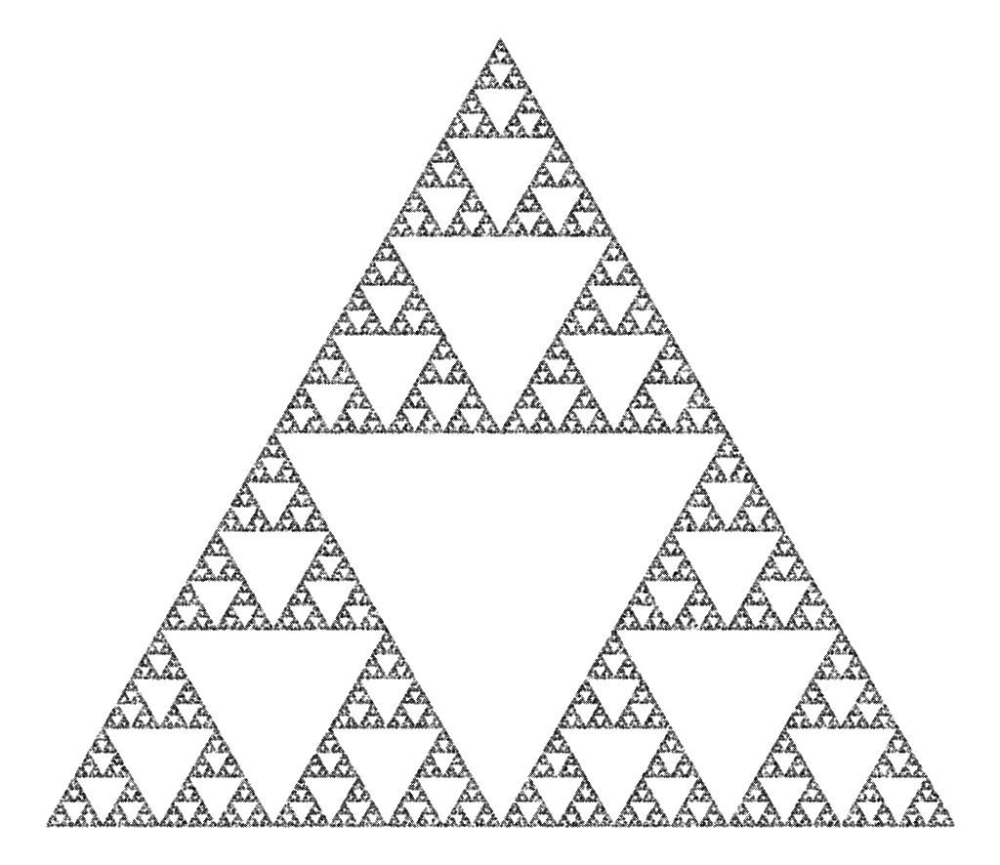
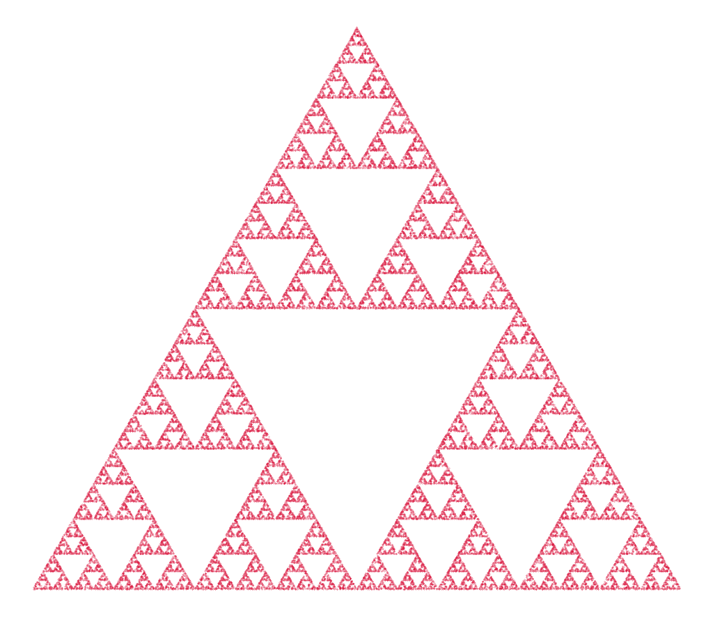
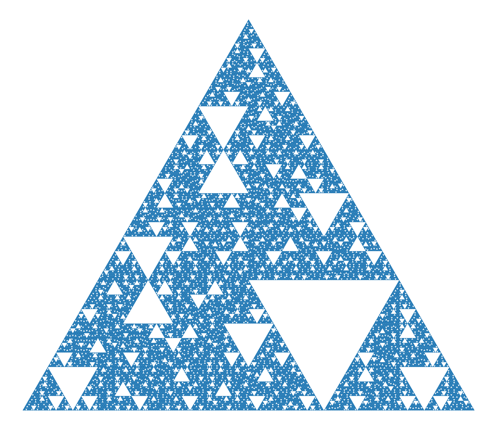

# Chaos-Game Irreversibility

Reproducible Python code demonstrating the **irreversibility** in the Chaos Game:
- Forward process: Sierpiński triangle
- Naive reverse process: systematic failure
- Extension: 8-map IFS (eight contracting maps)
- Headless-friendly scripts that **auto-save PNGs** when an interactive backend is not available

## Repository layout
```
scripts/
  fractal_irreversibility_paradox.py
  generate_ifs8_triangle.py
  fractal_irreversibility_paradox_show_or_save.py
  generate_ifs8_triangle_show_or_save.py
requirements.txt
run_all.sh
README.md
LICENSE
CITATION.cff
```

## Quickstart
```bash
python3 -m venv .venv && source .venv/bin/activate
pip install -r requirements.txt

# Interactive (GUI backend available)
python scripts/fractal_irreversibility_paradox_show_or_save.py
python scripts/generate_ifs8_triangle_show_or_save.py

# Headless / server
export MPLBACKEND=Agg
python scripts/fractal_irreversibility_paradox_show_or_save.py
python scripts/generate_ifs8_triangle_show_or_save.py
```

The scripts save the output images under `examples/` (no GUI window is shown):
- `examples/fractal_chaosgame.png`
- `examples/reverse_fractal_chaosgame.png`
- `examples/triangle_ifs8_gen5.png`


Forward (Sierpiński) — from `fractal_irreversibility_paradox_*`



8-map IFS (r = 1/3) — from `generate_ifs8_triangle_*`


The scripts save output images under `examples/`. No GUI window is shown.

## Reproducibility notes
- The code uses **ASCII quotes** (`'` and `"`). If you copy from a PDF, ensure quotes are preserved.
- Tested with Python ≥ 3.9, NumPy ≥ 1.20, Matplotlib ≥ 3.5.

## License
MIT — see `LICENSE`.

## How to cite
If you use this code, please cite the repository (see `CITATION.cff`).

---

**Project page:** https://github.com/andronacheion/chaos-game-irreversibility
